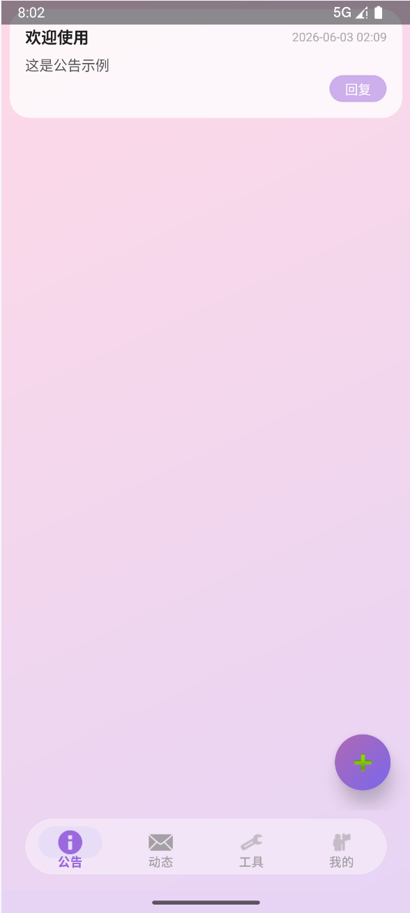
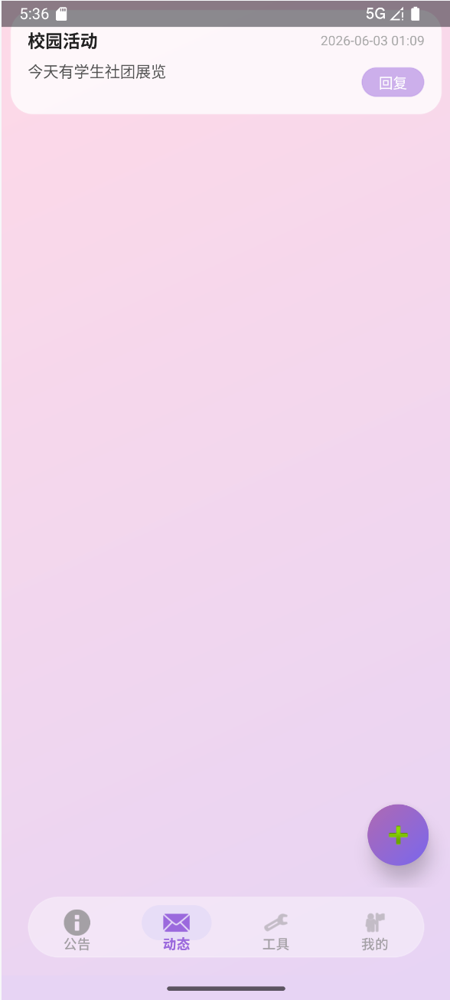
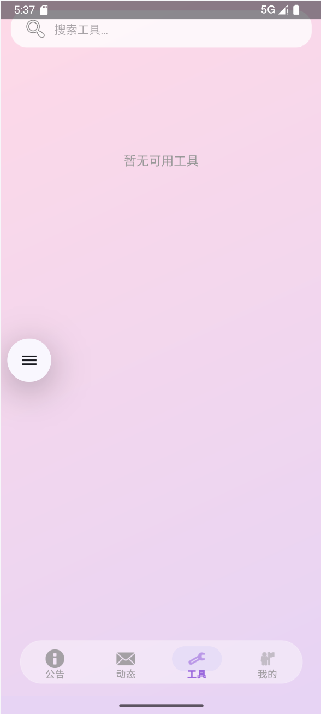
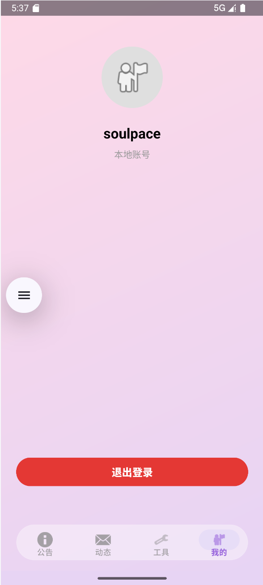

# 畅言论坛 (CA for Android)

<div align="center">


**畅言论坛** 是一款校园公告论坛 Android 应用，提供公告浏览、动态发布、工具分享等功能，采用本地 SQLite 数据库存储，无需后端服务器。

</div>

## 📱 应用截图

<div align="center">
  
  
  
  
</div>

> 💡 请将截图放置在 `screenshots` 目录下

## ✨ 功能特性

- 📢 **公告系统** - 浏览校园官方公告，支持回复互动
- 💬 **动态发布** - 发布个人动态，支持匿名发布
- 🔧 **工具分享** - 分享实用工具，支持实时搜索
- 👤 **个人中心** - 用户注册、登录、个人信息管理
- 💭 **回复系统** - 帖子回复功能，显示回复计数
- 🔍 **实时搜索** - 工具标签页支持关键词实时过滤
- 🎨 **毛玻璃 UI** - 采用紫色渐变 + 毛玻璃/亚克力视觉风格
- 🔐 **本地认证** - 基于 SharedPreferences 的登录状态持久化

## 🛠 技术栈

| 类别 | 技术 |
|------|------|
| 开发语言 | Java 1.8 |
| 最低 SDK | 21 (Android 5.0 Lollipop) |
| 目标 SDK | 33 (Android 13) |
| 编译 SDK | 34 (Android 14) |
| UI 框架 | Material Design 3 |
| 导航组件 | Jetpack Navigation Component |
| 布局框架 | ConstraintLayout, LinearLayout, FrameLayout |
| 列表组件 | RecyclerView |
| 本地数据库 | SQLite (SQLiteOpenHelper) |
| 状态持久化 | SharedPreferences |
| 构建工具 | Gradle (Version Catalog) |

## 📦 依赖库

```gradle
// AndroidX Core
implementation 'androidx.core:core-ktx:1.12.0'
implementation 'androidx.appcompat:appcompat:1.6.1'

// Material Design 3
implementation 'com.google.android.material:material:1.9.0'

// Layout
implementation 'androidx.constraintlayout:constraintlayout:2.1.4'

// Navigation
implementation 'androidx.navigation:navigation-fragment:2.7.5'
implementation 'androidx.navigation:navigation-ui:2.7.5'

// Testing
testImplementation 'junit:junit:4.13.2'
androidTestImplementation 'androidx.test.ext:junit:1.1.5'
androidTestImplementation 'androidx.test.espresso:espresso-core:3.5.1'
```

## 📁 项目结构

```
CAforAndroid/
├── app/
│   ├── build.gradle                    # 应用级构建配置
│   └── src/main/
│       ├── AndroidManifest.xml         # 应用清单
│       ├── java/com/forum/cy/
│       │   ├── MainActivity.java       # 主界面 (底部导航)
│       │   ├── LoginActivity.java      # 登录页面
│       │   ├── RegisterActivity.java   # 注册页面
│       │   ├── PostDetailActivity.java # 帖子详情页
│       │   ├── adapter/
│       │   │   ├── PostAdapter.java    # 帖子列表适配器
│       │   │   └── ReplyAdapter.java   # 回复列表适配器
│       │   ├── data/
│       │   │   └── DatabaseHelper.java # SQLite 数据库帮助类
│       │   ├── model/
│       │   │   ├── Post.java           # 帖子实体类
│       │   │   └── Reply.java          # 回复实体类
│       │   └── util/
│       │       ├── AuthManager.java    # 认证管理工具
│       │       └── BlurUtil.java       # 毛玻璃效果工具
│       └── res/
│           ├── drawable/               # 图形资源
│           ├── layout/                 # 布局文件
│           ├── navigation/             # 导航图
│           └── values/                 # 资源值
├── build.gradle                        # 项目级构建配置
├── settings.gradle                     # 项目设置
└── gradle.properties                   # Gradle 属性
```

## 🚀 快速开始

### 环境要求

- Android Studio Arctic Fox 或更高版本
- JDK 11 或更高版本
- Android SDK 34
- Gradle 8.0+

### 安装步骤

1. **克隆项目**
   ```bash
   git clone https://github.com/imply-love/CA-for-Android.git
   cd CA-for-Android
   ```

2. **使用 Android Studio 打开项目**
   
   - 打开 Android Studio
   - 选择 `File` -> `Open`
   - 选择项目根目录
   
3. **同步 Gradle**
   - Android Studio 会自动提示同步 Gradle
   - 或手动点击 `File` -> `Sync Project with Gradle Files`

4. **运行应用**
   - 连接 Android 设备或启动模拟器
   - 点击 `Run` -> `Run 'app'` 或按 `Shift + F10`

### 构建 APK

```bash
# Debug 版本
./gradlew assembleDebug

# Release 版本
./gradlew assembleRelease
```

生成的 APK 文件位于 `app/build/outputs/apk/` 目录下。

## 📖 使用说明

### 底部导航

应用采用四标签底部导航：

| 标签 | 功能 | 说明 |
|------|------|------|
| 📢 公告 | AnnounceFragment | 浏览校园官方公告 |
| 💬 动态 | DynamicFragment | 浏览和发布个人动态 |
| 🔧 工具 | ToolsFragment | 浏览工具，支持搜索 |
| 👤 我的 | ProfileFragment | 个人中心，登录/登出 |

### 发帖流程

1. 登录账号（未登录会提示登录）
2. 点击右下角的浮动按钮 (FAB)
3. 填写标题和内容
4. 动态标签页可选择匿名发布
5. 点击发布按钮

### 回复帖子

1. 点击帖子进入详情页
2. 在底部输入框输入回复内容
3. 动态类型的帖子支持匿名回复
4. 点击发送按钮

### 搜索工具

1. 切换到「工具」标签页
2. 点击顶部搜索框
3. 输入关键词
4. 实时显示匹配结果

## 🗄 数据库设计

### 数据库信息

- **数据库名**: `campus_announcement.db`
- **版本**: 2

### 数据表

#### posts 表 (帖子)

| 字段 | 类型 | 说明 |
|------|------|------|
| id | INTEGER | 主键，自增 |
| type | INTEGER | 帖子类型 (0=公告, 1=动态, 2=工具) |
| title | TEXT | 帖子标题 |
| content | TEXT | 帖子内容 |
| time | INTEGER | 发布时间 (毫秒时间戳) |
| author | TEXT | 作者用户名 |
| anonymous | INTEGER | 是否匿名 (0=否, 1=是) |

#### users 表 (用户)

| 字段 | 类型 | 说明 |
|------|------|------|
| id | INTEGER | 主键，自增 |
| username | TEXT | 用户名 (唯一) |
| password | TEXT | 密码 (明文存储) |

#### replies 表 (回复)

| 字段 | 类型 | 说明 |
|------|------|------|
| id | INTEGER | 主键，自增 |
| post_id | INTEGER | 关联的帖子 ID |
| content | TEXT | 回复内容 |
| time | INTEGER | 回复时间 (毫秒时间戳) |
| author | TEXT | 回复者用户名 |
| anonymous | INTEGER | 是否匿名 (0=否, 1=是) |

## 🎨 UI 设计

### 配色方案

应用采用紫色渐变 + 毛玻璃视觉风格：

- **背景**: 135° 线性渐变 (`#FFE8D5F5` → `#FFFFDAE8`)
- **卡片**: 半透明白色 (`#CCFFFFFF`) + 20dp 圆角
- **导航栏**: 胶囊形浮动底栏 (28dp 圆角)
- **按钮**: 16dp 圆角 + 毛玻璃效果
- **FAB**: 蓝紫到粉色渐变 (`#FF7B68EE` → `#FFB06AB3`)

### 设计特点

- Material Design 3 设计规范
- 边到边显示 (Edge-to-Edge)
- 透明状态栏和导航栏
- 原生毛玻璃效果实现 (无第三方库)

## 📱 Activity 说明

| Activity | 功能 | 特点 |
|----------|------|------|
| MainActivity | 主界面 | 底部导航 + Fragment 容器 |
| LoginActivity | 登录页 | 全屏登录界面 |
| RegisterActivity | 注册页 | 全屏注册界面 |
| PostDetailActivity | 帖子详情 | 帖子内容 + 回复列表 + 底部回复栏 |

## 🔧 配置说明

### Gradle 配置

- **最小堆内存**: 2048m
- **AndroidX**: 已启用
- **非传递 R 类**: 已启用

### 主题配置

使用 Material3 DayNight NoActionBar 主题，支持：

- 透明状态栏
- 透明导航栏
- 浅色/深色模式

## 🤝 贡献指南

欢迎贡献代码！请遵循以下步骤：

1. Fork 本仓库
2. 创建功能分支 (`git checkout -b feature/AmazingFeature`)
3. 提交更改 (`git commit -m 'Add some AmazingFeature'`)
4. 推送到分支 (`git push origin feature/AmazingFeature`)
5. 创建 Pull Request

### 代码规范

- 遵循 Java 编码规范
- 使用有意义的变量和方法名
- 添加必要的注释
- 保持代码简洁

## 📋 待办事项

- [ ] 添加帖子编辑和删除功能
- [ ] 实现用户头像上传
- [ ] 添加消息通知系统
- [ ] 优化数据库查询性能
- [ ] 添加帖子收藏功能
- [ ] 实现夜间模式
- [ ] 添加图片上传功能
- [ ] 优化 UI 动画效果

## 🐛 已知问题

- 密码明文存储，存在安全隐患
- 缺少网络同步功能
- 无数据备份和恢复机制

## 📄 许可证

本项目采用 MIT 许可证 - 查看 [LICENSE](LICENSE) 文件了解详情

```
MIT License

Copyright (c) 2024 畅言论坛

Permission is hereby granted, free of charge, to any person obtaining a copy
of this software and associated documentation files (the "Software"), to deal
in the Software without restriction, including without limitation the rights
to use, copy, modify, merge, publish, distribute, sublicense, and/or sell
copies of the Software, and to permit persons to whom the Software is
furnished to do so, subject to the following conditions:

The above copyright notice and this permission notice shall be included in all
copies or substantial portions of the Software.

THE SOFTWARE IS PROVIDED "AS IS", WITHOUT WARRANTY OF ANY KIND, EXPRESS OR
IMPLIED, INCLUDING BUT NOT LIMITED TO THE WARRANTIES OF MERCHANTABILITY,
FITNESS FOR A PARTICULAR PURPOSE AND NONINFRINGEMENT. IN NO EVENT SHALL THE
AUTHORS OR COPYRIGHT HOLDERS BE LIABLE FOR ANY CLAIM, DAMAGES OR OTHER
LIABILITY, WHETHER IN AN ACTION OF CONTRACT, TORT OR OTHERWISE, ARISING FROM,
OUT OF OR IN CONNECTION WITH THE SOFTWARE OR THE USE OR OTHER DEALINGS IN THE
SOFTWARE.
```

## 📧 联系方式

如有问题或建议，请通过以下方式联系：

- 提交 [Issue](https://github.com/yourusername/CAforAndroid/issues)
- 发送邮件至：syzygy.imply@outlook.com

## 🙏 致谢

- [Material Design 3](https://m3.material.io/) - UI 设计规范
- [Android Jetpack](https://developer.android.com/jetpack) - 现代 Android 开发组件
- [AndroidX](https://developer.android.com/jetpack/androidx) - Android 扩展库

---

<div align="center">

**如果觉得这个项目有帮助，请给个 ⭐️ Star 支持一下！**

Made with ❤️ by SoulPace

</div>	
